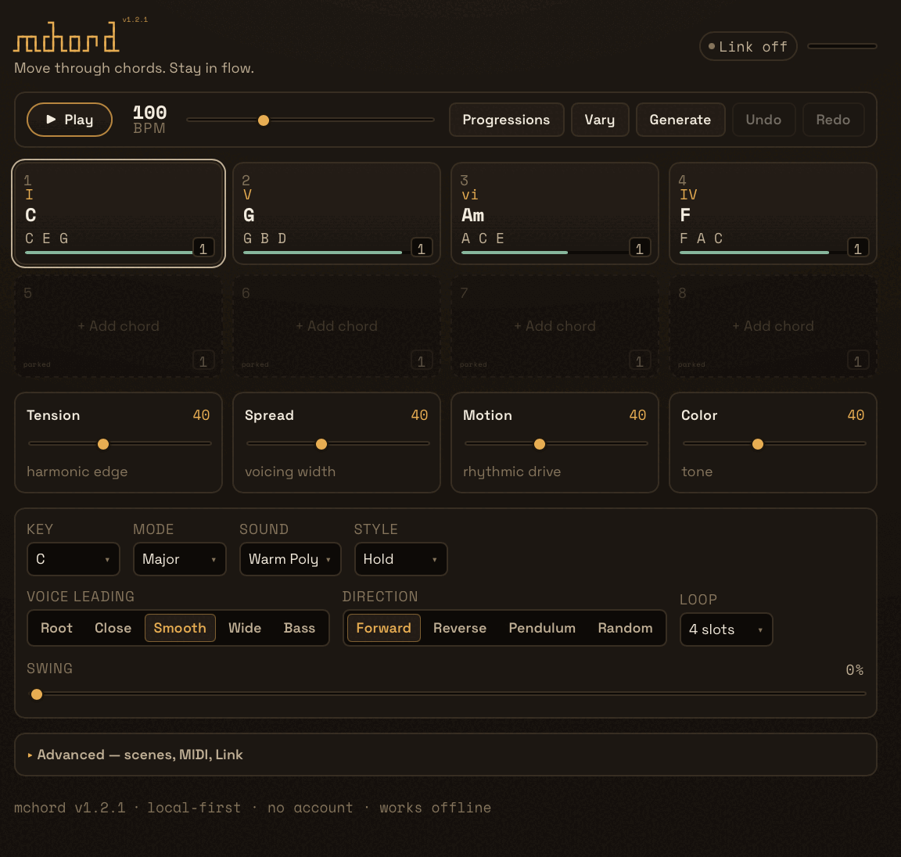

<div align="center">

# mchord

**Move through chords. Stay in flow.**

<pre>
    ┓      ┓
┏┳┓┏┣┓┏┓┏┓┏┫
┛┗┗┗┛┗┗┛┛ ┗┻
</pre>

[](./package.json)
[](./LICENSE)
[](#verification)
[](./tsconfig.json)
[](https://react.dev)
[](https://vite.dev)
[](https://developer.mozilla.org/docs/Web/API/Web_Audio_API)
[](#progressive-web-app)

### [▶ Play it live → mchord.mpump.live](https://mchord.mpump.live)

<br>



</div>

---

`mchord` is a browser-native, harmony-first performance instrument. Its primary object is the **chord** — not tracks, clips, or a piano roll. Lay a progression into eight slots, let a pure theory engine voice it with smooth, deterministic **voice leading**, animate it with a rhythm style, and play it through a built-in polyphonic synth — or send the voiced notes to MIDI gear, a DAW, or [mpumpit](https://mpumpit.mpump.live). It's local-first and offline-capable: no account, no cookies, no telemetry, and no audio ever leaves the page.

## Highlights

- **Harmony-first** — think in chords and progressions, not individual notes. Twelve keys, ten modes (major, natural minor, dorian, mixolydian, phrygian, lydian, harmonic minor, locrian, melodic minor, harmonic major), and twenty-three chord families (triads, 6ths, 7ths, 9ths, sus, half-diminished, altered dominants, 13ths, maj7♯11, power).
- **Deterministic voice leading** — eight modes (Root · Close · Smooth · Wide · Bass · Quartal · Drop-2 · Shell). Smooth/Bass search inversions and octaves to minimise total semitone movement between adjacent chords, penalising voice crossing and out-of-range notes; Quartal stacks fourths, Drop-2 opens a close voicing, and Shell keeps just the guide tones — the same progression voices the same way every time.
- **Eight chord slots** with a moving playhead — active (amber) and queued (rose) states are unmistakable. Each slot shows its Roman numeral, key-correct name, compact spelling, and a stability/colour cue.
- **Loop the slots you want** — set the loop length (1–8); slots beyond it stay editable but parked (silent).
- **Harmonically-aware palette** — diatonic chords first, then borrowed and chromatic, coloured by stability so tension reads at a glance.
- **Normalized progression catalog** — 246 canonical chord progressions across 24 genres: 20 electronic genres (mirroring mpump's genre list) plus jazz, pop, cinematic, and gospel. Each canonical entry appears once and is tagged to one or more genres (no duplicated chord data), with typed provenance, review status, harmonic-intent tags, and per-event durations. Search by name/alias, filter by mode, or browse by genre; excerpts, reductions, and unverified entries are labelled. Load one into your current key with a click. Or **type a progression by name** (`Cmaj7 Am7 Dm7 G7`) from the header and drop it straight into the slots. Click the BPM readout to type an exact tempo.
- **Four performance macros** — Tension · Spread · Motion · Color — each sweeps a curated group of voicing and synth parameters.
- **37 play styles in 7 groups** — Block, Arp (up/down/updown/broken + converge/diverge/thumb/octaves), Strum, Melodic (guide-tone/top-line/pedal), Ostinato (Alberti/gallop/cell), Euclidean (E3/E5/E7), and **Split (bass + melody)** — performances that play the chord as a low bass voice plus a moving melody/arp in a different octave (house, techno, trance, dub, synthwave, lo-fi, garage, ambient, dubstep, downtempo, psy, DnB). All responsive to BPM, swing, and Motion, with forward / reverse / pendulum / seeded-random playback.
- **Built-in polyphonic synth** — eight authored presets and four macros over a native Web Audio voice graph (detuned oscillators, filter + ADSR, stereo spread) into a glue compressor and a native master limiter. Click-free preset changes, panic, no hung notes.
- **Microtuning (12-note)** — pick a temperament (just intonation, meantone, Werckmeister/Kirnberger well-temperaments, maqam/pelog/slendro, EDOs, and more) or import your own 12-tone `.scl` (Scala) file; the chosen tuning rides along in save/share. Retunes only the final pitch→Hz mapping, so the harmony engine is untouched and 12-TET is the byte-identical default. The tuning core is vendored verbatim from [mdrone](https://mdrone.mpump.live) (`src/vendor/tuning-core`; see NOTICE).
  - **Tuning anchor** — choose which note the tuning table is rooted on: **Follow key** (the tonic is always pure — what JI and maqam scales mean), **Fixed C** (the historically-authentic reading of well-temperaments), or any fixed note. New scenes default to Follow key; scenes and share links saved before this setting existed load as Fixed C, so they sound exactly as they always did. Microtuning (anchor included) applies to the internal synth only — MIDI out remains 12-TET.
- **Resume, save & share** — the working session autosaves for “Continue Last Session”; named sessions use versioned local persistence with migrations, readable JSON import/export, and self-contained share links — no backend.
- **Optional MIDI in/out + clock** — sends the *actual voiced notes* (not root-position) with correct note-ownership and note-offs; channel select and 24-PPQN clock. Never required.
- **Optional Ableton Link** — tempo-follow and quantised start via the companion **mpump** link-bridge; degrades gracefully when it's absent.
- **Optional mbus publish** — the “bus” toggle in the top bar offers mchord's master output to the [mbus](https://mbus.mpump.live) patchbay as a source named `mchord` (tab-to-tab WebRTC via the same link-bridge, peer-to-peer, no server). Off by default; harmless without the bridge. Local mute doesn't cut the bus feed — like MIDI out, it only silences the browser monitor.
- **Installable PWA** — network-first navigation, cache-first hashed assets, offline after one visit.

## Run locally

```bash
npm install
npm run dev
```

Open the URL Vite prints — audio starts on your first interaction (pressing Play or triggering a chord), per browser autoplay policy.

## Scripts

| Script | Purpose |
| --- | --- |
| `npm run dev` | Vite dev server with HMR |
| `npm run build` | Type-check (`tsc -b`) and production build |
| `npm run preview` | Serve the production build locally |
| `npm run lint` | ESLint |
| `npm run test` | Vitest (run once) |
| `npm run test:watch` | Vitest in watch mode |
| `npm run typecheck` | Type-check without emit |
| `npm run vendored:check` | Verify `src/vendor/tuning-core` matches `../mdrone` |
| `npm run vendored:sync` | Re-vendor the tuning core from `../mdrone` |
| `npm run check` | **vendored:check + typecheck + lint + test + build** (the full gate) |

## Keyboard

Shortcuts are ignored while typing into a field.

| Keys | Action |
| --- | --- |
| `1`–`8` | trigger chord slot (live, quantised while playing) |
| `Space` | start / stop the progression |
| `← → ↑ ↓` | move the selected slot |
| `Enter` | open / commit the chord palette for the selected slot |
| `R` / `Shift`+`R` | vary / generate the progression |
| `⌘`/`Ctrl`+`Z` | undo |
| `Shift`+`⌘`/`Ctrl`+`Z` | redo |
| `Esc` | close overlays |

## Architecture

```text
pure & framework-free                 React boundary                 audio thread
─────────────────────                 ──────────────                 ────────────
harmony/  (theory, voice leading) ─┐
                                   ├─▶ state/ (reducer + undo) ─▶ useInstrument ─┐
generation (seeded, reproducible) ─┘                                            │
                                                          ┌─ NoteSink fan-out ◀─┤
transport/ Scheduler (lookahead, ◀── sample clock ────────┤                     │
  "two clocks", React-independent)                        ├─▶ audio/ AudioEngine ─▶ native voice
                                                          │     (pool → glue comp → limiter)
                                                          └─▶ midi/ MidiOutput (voiced notes)
```

- **The harmony engine is pure** — no React, no Web Audio, no DOM, fully deterministic, exhaustively tested.
- **Timing never touches React.** A lookahead scheduler (the "two clocks" pattern) schedules every note at absolute `AudioContext` times; the UI drives nothing.
- **One `NoteSink` contract** is implemented by both the audio engine and MIDI out, so the scheduler broadcasts the same voiced notes to both at the same sample-accurate time.
- **Validation at every boundary** — localStorage, share URLs, MIDI, and the engine all pass untrusted data through a total sanitiser.

See [`docs/architecture.md`](./docs/architecture.md) for detail.

## Verification

```bash
npm run check   # vendored:check + typecheck + lint + 385 tests + production build
```

Tests are deterministic and live next to the code (scales, chords, spelling, voice-leading determinism, generation, reducer + undo, scheduler planning, rhythm, MIDI bytes + note ownership, persistence migrations, share round-trips, keyboard map). Vitest runs in a Node environment, so live audio is covered by the manual QA checklist, not unit tests.

## Privacy

Everything is local. No account, no cookies, no telemetry, no fingerprinting. The last working session and named saved sessions live in your browser's `localStorage`; share links carry the scene in the URL fragment and never hit a server. No audio or MIDI data is sent anywhere.

## Browser notes & limitations

- Audio starts on the first user gesture (pressing Play or triggering a chord), per browser autoplay policy.
- The engine uses the real `AudioContext.sampleRate` and never assumes 44.1/48 kHz.
- **Web MIDI** is requested only when you enable it, and is optional (Chromium-family browsers).
- **Ableton Link** needs the companion **mpump** link-bridge running locally (`ws://localhost:19876`); without it the Link panel simply stays offline.
- **mbus publish** rides the same link-bridge; without it the “bus” toggle just keeps retrying quietly and nothing is published. Audio flows tab-to-tab over WebRTC and never leaves the machine.
- A PWA install does not provide background or lock-screen audio.

## Repository map

```text
src/
  types.ts            shared contracts — every cross-module type lives here
  App.tsx             UI composition + global keyboard
  main.tsx            entry, service-worker registration, font imports
  harmony/            pure theory engine
    scales · chords · spelling · labels · palette · voiceLeading · generation
  audio/              native Web Audio engine
    AudioEngine · Voice · MasterBus · presets · macros · voiceParams · dsp
  tuning/             12-note microtuning bridge (cents-offset table, .scl import)
  vendor/tuning-core  tuning model + Scala + builtins, vendored from mdrone
  transport/          lookahead scheduler + rhythm + Ableton Link adapter
    scheduler · rhythm · clock · rng · link · linkBridge · linkClock
    mbus/             vendored mbus-client (patchbay publish; see NOTICE)
  midi/               optional Web MIDI (router · ownership · parse · messages)
  persistence/        versioned scenes + migrations (localStorage)
  sharing/            backend-free share-link codec
  state/              reducer + bounded undo/redo + keyboard map
  app/                useInstrument bridge + NoteSink composition
  components/         chord slots, palette, transport, macros, controls, modals
  styles/             theme tokens + global CSS
public/               manifest, service worker, icon, CNAME, robots
.github/workflows/    CI + GitHub Pages deploy
docs/                 architecture + physical-device QA checklist
```

## Progressive Web App

`public/manifest.webmanifest` + `public/sw.js` make `mchord` installable. The service worker is **network-first for navigations** (so a deploy never serves a stale shell) and cache-first for hashed assets. At install it precaches the shell plus the content-hashed build assets listed in a generated `precache-manifest.json` (emitted by a small Vite plugin), so the full app works offline after a single successful load.

## Deployment

Pushes to `main` are deployed by GitHub Actions to GitHub Pages, served at the custom domain **[mchord.mpump.live](https://mchord.mpump.live)**. It's a root-domain deploy, so the build is root-relative and `public/CNAME` pins the domain across deploys. Set **Settings → Pages → Source** to **GitHub Actions** if prompted.

## Family

mchord is part of the **mpump** family of browser-native instruments — alongside [mpump](https://mpump.live), [mdrone](https://mdrone.mpump.live), [mgrains](https://mgrains.mpump.live), [mloop](https://mloop.mpump.live), and others. Reused code is credited in [`NOTICE`](./NOTICE).

## License

[GNU Affero General Public License v3.0 or later](./LICENSE).
